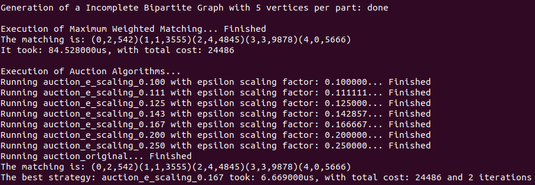

# Maximum Weighted Matching & Auction Algorithm Comparison 
Project based on the comparison of an implementation of [Auction Algorithm](https://web.mit.edu/dimitrib/www/Auction_Trans.pdf) and the [Maximum Weighted Matching](https://www.boost.org/doc/libs/1_79_0/libs/graph/doc/maximum_weighted_matching.html) from the Boost Graph Library

## Startup
In order to run the benchmark you have to run these command in your console:
```
sudo apt update
sudo apt install build-essential
sudo apt-get install libboost-all-dev
```

After that, to compile the project, you have to jump into the */app/src* folder and type the following line in your console:

```
g++ -std=c++2a -o ../bin/app BipartiteGraph.cpp MaximumWeightedMatching.cpp Auction.cpp Main.cpp
```

For compier optimization instead type:
```
g++ -std=c++2a -Ofast -o ../bin/app BipartiteGraph.cpp MaximumWeightedMatching.cpp Auction.cpp Main.cpp
```

The *.exe* file will be inserted into the */app/bin* directory.

## Usage
Start the application by typing ```./app```. Next you have to specify:
* The **VERBOSE mode**, _0_ or _1_
* The **type of Bipartite Graph** to take into examination,   _Incomplete (0)_ or _Complete (1)_
* The **starting number** of vertices per part of the bipartite graph
* The **ending number** of vertices per part of the bipartite graph


After have inserted these four options, at each random bipartite graph the application will execute:
* **Maximum Weighted Matching**
* **Auction Algorithms:**
	* _Original Auction Algorithm_
	* _Auction Algorithms with e-scaling from scaling factor 1/4 to 1/10_

During the benchmark the application at the end of execution of Maximum Weighted Matching and only for the best Auction Algorithm will show the solution of the Assignment Problem in the following form: **(FROM vertex, TO vertex, WEIGHT)**.

In addition, in both strategies we will get the total cost of the matching and execution time. But only for the best Auction Algorithm we will also have the number of iteration for the specific Assignment Problem.


* VERBOSE mode **OFF**

	

* VERBOSE mode **ON**

	

When the benchmark is finished the application generates a resulting *.csv* file stored into the */results* directory and named like so: **complete / incomplete + starting number of vertices + ending number of vertices + datetime .csv**. This file is generated in order to have a look at the complete score of all the algorithms.
