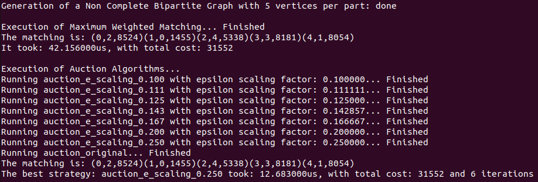

# Maximum Weighted Matching & Auction Algorithm Comparison 
Project based on the comparison of the [Auction Algorithm](https://web.mit.edu/dimitrib/www/Auction_Trans.pdf) and the [Maximum Weighted Maching](https://www.boost.org/doc/libs/1_79_0/libs/graph/doc/maximum_weighted_matching.html) from Boost Library

## Startup
In order to run the benchmark you have to run these command in your console:
```
sudo apt update
sudo apt install build-essential
sudo apt-get install libboost-all-dev
```

After that, to compile the project, you have to jump into the */src* folder and type the following line in your console:

```
g++ -std=c++2a -o ../bin/app BipartiteGraph.cpp MaximumWeightedMatching.cpp Auction.cpp Main.cpp
```

For compier optimization instead type:
```
g++ -std=c++2a -Ofast -o ../bin/app BipartiteGraph.cpp MaximumWeightedMatching.cpp Auction.cpp Main.cpp
```

The *.exe* file will be inserted into the */bin* directory.

## Usage
Start the application by typing ```./app _ _```, where the two _ correspond to the two options, verbose and fully_connected, they accept only 0,1 values. Next you have to specify the starting and ending number of verticies per part of the bipartite graphs.


After pressing enter, at each random bipartite graphs the application pass them respectively to:
* **Maximum Weighted Matching**
* **Auction Algorithm**



When the benchmark is finished the application generate a *.csv* file stored into the */data* directory, in order to have a look on the complete score of all of three algorithm.

Th default value of the VERBOSE option is *false*, to change it you have to modify line 6 of the main file. The result of this change is the following:

